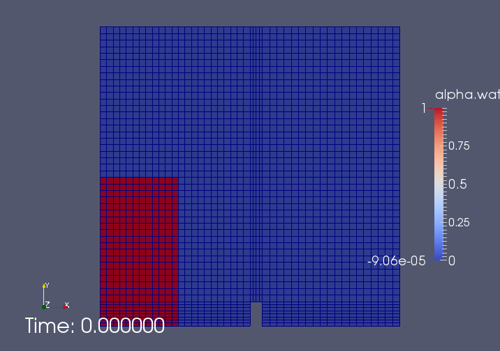
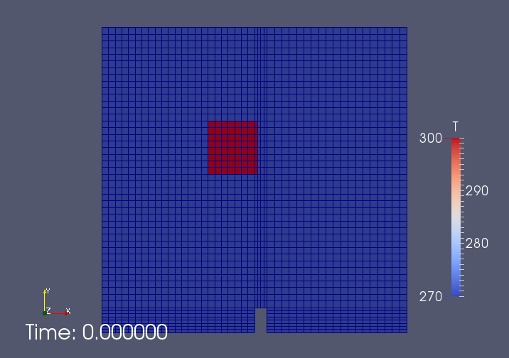
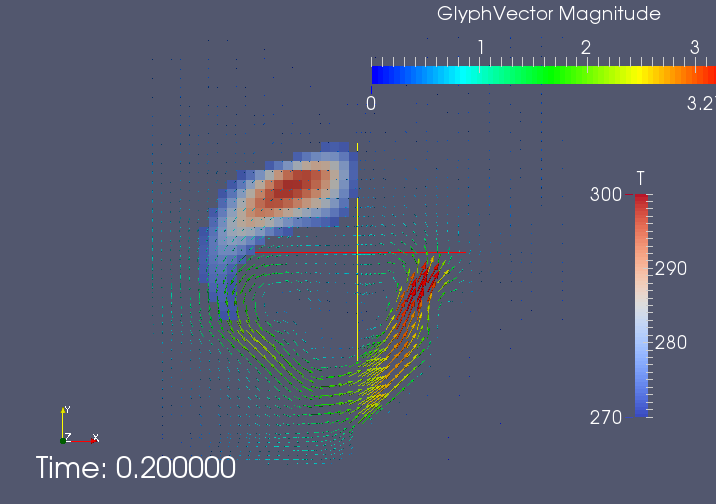

# OpenFOAMのカスタマイズ・ソースコード改造入門（interFoam への温度場計算追加） #

## 目的 ##

　OpenFOAM の標準ソルバ・標準ライブラリの改造に挑戦し，OpenFOAMのプログラミングについて学習する。

## 環境 ##

　この資料は，OpenFOAM 2.3.0 を基準として作成した。

　 *OpenFOAM 2.3.x では，コードに変更があるため，本資料のままではコンパイルすることができません。*

## 想定する受講者・前提知識 ##

- OpenFOAMのごく基本的な事を知っている。（例題の1つや2つを実行したことがある。）

- 何らかのプログラミング言語を学習したことがあり，プログラミングに関する基本的な知識がある。（変数，関数，型，などの基礎知識）

- Linuxの端末上で，ごく基本的な操作ができる。（テキストに書いてあることをタイプして実行できる。）

- Linux上で，ファイルのコピーや移動ができる。　

## 参考情報 ##
[Adding temperature to InterFOAM, with edited source code (OpenFOAM v. 2.3.0); Damiano Natali (Wolf dynamics).](http://www.wolfdynamics.com/conferences-and-publications.html "Adding temperature to InterFOAM, with edited source code (OpenFOAM v. 2.3.0)")

　上記参考情報では，incompressibleTwoPhaseMixtureクラスを改造している。

　今回は，incompressibleTwoPhaseMixtureクラスはそのままとして，これをベースにした新しいクラスincompressibleTwoPhaseTempMixture を作成することにする。

## 目次 ##

0.   [準備](#pre)
  1. [本書の標記](#remarks)
  2. [Linuxコマンドの確認](#linuxCommand)
  3. [環境変数](#checkEnvVariables)
0. [方針](#how)
1.   [ライブラリの改造](#modifyLibrary)
  1. 標準ライブラリのファイルをコピー
  2. myIncompressibleTwoPhaseMixture.H の修正
  3. myIncompressibleTwoPhaseMixture.C の修正
      - コンストラクタの修正
      - read()関数の修正
  4. Make/files の修正とコンパイル
2.   [ソルバの修正](#modifySolver)
  1. 標準ソルバのファイルをコピー
  2. interTempFoam.C の修正
  3. createFields.H の修正
  4. alphaEqnSubCycle.H の修正
  5. alphaEqn.H の修正
  6. TEqn.H の修正
  7. Make/files の修正
  8. Make/options の修正
  9. コンパイル
3.   [サンプルケースの作成	](#createSampleCase)
  1. 標準チュートリアルのファイルをコピー
  2. constant/transportProperties ファイルの修正
  3. 0/T ファイルの作成
  4. system/controlDict
  5. system/fvSchemes ファイルの修正
  6. system/fvSolution ファイルの修正
  7. system/setFieldsDict ファイルの修正
  8. 実行スクリプト Allrun と Allclean の修正
4.   [計算の実行](#tutorial)
5.   [発展・備考](#further)

## 準備

### 本書の標記について

端末で実行するコマンド

> echo $FOAM_SRC

プログラムのソースコード

    int n;

### Linuxコマンドの確認

端末内での実行場所移動：cd （チェンジ ディレクトリ）

> cd _移動先_

ディレクトリの作成：mkdir （メーク ディレクトリ）

> mkdir _ディレクトリ名_

　オプション　-p   親ディレクトリも同時に作成

ファイルやディレクトリのコピー：cp （コピー）

> cp _元ファイル_ _コピー先_

オプション　-p   元のファイル属性を保持（preserve）
オプション　-r   ディレクトリの中身もコピー ← 再帰的にコピー（recursive）

ファイルやディレクトリの移動：mv （ムーブ）

> mv _移動元_ _移動先_

　このコマンドは，名前の変更にも使う。

### 環境変数の確認

環境変数の確認方法など。各自の環境変数を調べ，別紙に記入してください。

システムのOpenFOAMソースコード格納場所：$FOAM_SRC
> echo $FOAM_SRC

ユーザーのOpenFOAM関連ファイル格納場所：$WM_PROJECT_USER_DIR
> echo $WM_PROJECT_USER_DIR

FOAM_USER_LIBBIN

FOAM_USER_APPBIN

[［手順一覧に戻る］](#tableOfContents)

## 方針

### 基礎式

連続の式

VOF

運動量輸送式

　重力項， 表面張力項

エネルギ輸送式

　熱伝導率 k は、密度 rho，定圧比熱 cp，プラントル数 Pr から求めることとする。k = rho cp / Pr
　新たな変数として、定圧比熱とプラントル数を myIncompressibleTwoPhaseMixture に組み込む。

[［手順一覧に戻る］](#tableOfContents)

## ライブラリの改造

　本章では，標準ライブラリ incompressibleTwoPhaseMixture をベースとして，新たに温度に関する情報を取り扱うことが可能なライブラリ myIncompressibleTwoPhaseMixture を作成する。

### 標準ライブラリ ソースコードのコピー

　$WM_PROJECT_USER_DIR の下に src/transportModels/ ディレクトリを作成する。ここに、$FOAM_SRC/transportModels/incompressible の内容をコピーする。また，コンパイル時に必要なため，$FOAM_SRC/transportModels/twoPhaseMixtureもコピーする。

>    cd $WM_PROJECT_USER_DIR

>    mkdir -p src/transportModels/

>    cd src/transportModels/

>    cp -rp $FOAM_SRC/transportModels/incompressible .

>    cp -rp $FOAM_SRC/transportModels/twoPhaseMixture .

　コピーした incompressibleTwoPhaseMixture を改造するため、 myIncompressibleTwoPhaseMixture という名前に変換する。

>    cd incompressible

>    cp -r incompressibleTwoPhaseMixture myIncompressibleTwoPhaseMixture

>    cd myIncompressibleTwoPhaseMixture

拡張子がdepのファイルは不要なので削除する。
>    rm *.dep

　ファイル名を変更する。（incompressibleTwoPhaseMixture.CからmyIncompressibleTwoPhaseMixture.Cに。incompressibleTwoPhaseMixture.HからmyIncompressibleTwoPhaseMixture.Hに。）

>    mv incompressibleTwoPhaseMixture.C myIncompressibleTwoPhaseMixture.C

>    mv incompressibleTwoPhaseMixture.H myIncompressibleTwoPhaseMixture.H

　熱伝導率 k は、密度 rho，定圧比熱 cp，プラントル数 Pr から求めることとする。k = rho cp / Pr
　新たな変数として、定圧比熱とプラントル数を myIncompressibleTwoPhaseMixture に組み込む。

### myIncompressibleTwoPhaseMixture.H の修正

　myIncompressibleTwoPhaseMixture.Hファイルを修正する。incompressibleTwoPhaseMixture　を myIncompressibleTwoPhaseMixture に置換する。

>    sed -i".org" -e "s/incompressibleTwoPhaseMixture/myIncompressibleTwoPhaseMixture/g" myIncompressibleTwoPhaseMixture.H

　myIncompressibleTwoPhaseMixture.Hファイル に定圧比熱（cp）とプラントル数（Pr）の宣言を追加する。密度宣言の下(68行目付近)に下記を追記する。変数名に付けた数字は，流体の種類を識別するために付けた。OpenFOAMでは，クラス内部の変数名の最後にはアンダーバーを付記する。

    dimensionedScalar cp1_;
    dimensionedScalar cp2_;
    dimensionedScalar Pr1_;
    dimensionedScalar Pr2_;

　上記の変数をクラス外部から取得するための関数を定義する。rho1()関数（130行目付近）を参考にして，下記を追記する。

    //- Return const-access to phase1 cp
    const dimensionedScalar& cp1() const
    {
        return cp1_;
    }
    //- Return const-access to phase2 cp
    const dimensionedScalar& cp2() const
    {
        return cp2_;
    }
    //- Return const-access to phase1 Pr
    const dimensionedScalar& Pr1() const
    {
        return Pr1_;
    }
    //- Return const-access to phase2 Pr
    const dimensionedScalar& Pr2() const
    {
        return Pr2_;
    }

　さらに，セル界面での熱伝導率を求める関数 kappaf()の定義を加える。muf()（157行目付近）を参考にして，下記を追加する。

        //- Return the face-interpolated thermal conductivity
        tmp<surfaceScalarField> kappaf() const;

　myIncompressibleTwoPhaseMixture.H の修正はここまで。ファイルを上書き保存する。

### myIncompressibleTwoPhaseMixture.C の修正

　myIncompressibleTwoPhaseMixture.C ファイルを修正する。incompressibleTwoPhaseMixture　を myIncompressibleTwoPhaseMixture に置換する。

>    sed -i".org" -e "s/incompressibleTwoPhaseMixture/myIncompressibleTwoPhaseMixture/g" myIncompressibleTwoPhaseMixture.C

#### コンストラクタの修正

　コンストラクタ（Foam::myIncompressibleTwoPhaseMixture::myIncompressibleTwoPhaseMixture）の初期化時に，transportPropertiesファイルから読み込んだ値を変数に与えている。この部分に，先ほど追加した変数の初期化を追記する。rhoの初期化（93行目付近）を参考に，下記を追記する。

    cp1_("cp", dimensionSet(0, 2, -2, -1, 0, 0, 0), nuModel1_->viscosityProperties().lookup("cp")),
    cp2_("cp", dimensionSet(0, 2, -2, -1, 0, 0, 0), nuModel2_->viscosityProperties().lookup("cp")),
    Pr1_("Pr", dimensionSet(0, 0, 0, 0, 0, 0, 0), nuModel1_->viscosityProperties().lookup("Pr")),
    Pr2_("Pr", dimensionSet(0, 0, 0, 0, 0, 0, 0), nuModel2_->viscosityProperties().lookup("Pr")),

#### read()関数の修正

　read()関数にも，transportPropertiesファイルの内容を読み込む部分がある。ここにも，rho（205行目付近）を参考にして，下記を追記する。

    nuModel1_->viscosityProperties().lookup("cp") >> cp1_;
    nuModel2_->viscosityProperties().lookup("cp") >> cp2_;
    nuModel1_->viscosityProperties().lookup("Pr") >> Pr1_;
    nuModel2_->viscosityProperties().lookup("Pr") >> Pr2_;

熱伝導率を求める関数 kappaf()を作成する。粘度を求める関数muf()（145行目付近）を参考にして，下記を追加する。

    Foam::tmp<Foam::surfaceScalarField>
    Foam::myIncompressibleTwoPhaseMixture::kappaf() const
    {
        const surfaceScalarField alpha1f
        (
            min(max(fvc::interpolate(alpha1_), scalar(0)), scalar(1))
        );

        return tmp<surfaceScalarField>
        (
            new surfaceScalarField
            (
                "kappaf",
                alpha1f*rho1_*cp1_/Pr1_*fvc::interpolate(nuModel1_->nu())
              + (scalar(1) - alpha1f)*rho2_*cp2_/Pr2_*fvc::interpolate(nuModel2_->nu())
            )
        );
    }

myIncompressibleTwoPhaseMixture.C の修正はここまで。ファイルを上書き保存する。

### Make/files の修正とコンパイル

　Makeディレクトリ内のfilesファイルを修正する。最後の2行を，下記に変更し，保存する。

    myIncompressibleTwoPhaseMixture/myIncompressibleTwoPhaseMixture.C
    LIB = $(FOAM_USER_LIBBIN)/libmyIncompressibleTransportModels

　上記2行目は，コンパイル後のライブラリの置き場所を，ユーザーカスタマイズライブラリの場所FOAM_USER_LIBBINとしている。

　これまで作業してきたディレクトリの1つ上に戻り，コンパイルを行う。まず，過去のコンパイル情報を削除するために wclean を実行し，次に，ライブラリのコンパイルコマンド wmake libso を実行する。

>    cd $WM_PROJECT_USER_DIR/src/transportModels/incompressible

>    wclean

>    wmake libso

　コンパイルに成功すると，$FOAM_USER_LIBBINディレクトリに，libmyIncompressibleTransportModels.so が作成される。

　ソルバの修正に進む。

[［手順一覧に戻る］](#tableOfContents)

## ソルバの修正

### 標準ライブラリのファイルをコピー

　$WM_PROJECT_USER_DIR の下に applications/solvers/multiphase/ ディレクトリを作成する。　ここに，$FOAM_APP/solvers/multiphase/interFoam の内容をコピーする。

>    cd $WM_PROJECT_USER_DIR

>    mkdir -p applications/solvers/multiphase/

>    cd applications/solvers/multiphase/

>    cp -rp $FOAM_APP/solvers/multiphase/interFoam .

　ディレクトリ名を interFoam から interTempFoam に変更する。

>    mv interFoam interTempFoam

　ファイル名を interFoam.C から interTempFoam.C に変更する

> cd interTempFoam

> mv interFoam.C interTempFoam.C

### interTempFoam.C の修正

　先に作成した myIncompressibleTwoPhaseMixture を使うように，44行目を次に書き換える。

    #include "myIncompressibleTwoPhaseMixture.H"

　ソルバのソースコードで、TEqn.Hをインクルードする。pressure-velocity loop の後(109行目付近)に。

    #include "TEqn.H"

### createFields.H の修正

　まず，incompressibleTwoPhaseMixture に代わって myIncompressibleTwoPhaseMixture を使うように，49行目を下記に書き換える。

    myIncompressibleTwoPhaseMixture twoPhaseProperties(U, phi);

　createFields.H ファイルを修正し、cp と T と rho cp と rho phi cp とを定義する。 cp と T とは、p_rghを参考にする。rho cp は rho を参考にする。rho phi cp は rhoPhi を参考にする。

　14行目付近に温度

    Info<< "Reading field T\n" << endl;
    volScalarField T
    (
        IOobject
        (
            "T",
            runTime.timeName(),
            mesh,
            IOobject::MUST_READ,
            IOobject::AUTO_WRITE
        ),
        mesh
    );

　cp1とcp2とを、twoPhasePropertiesから読み込む。rho1とrho2（55行目付近）を参考にする。

    const dimensionedScalar& cp1 = twoPhaseProperties.cp1();
    const dimensionedScalar& cp2 = twoPhaseProperties.cp2();

　rho（63行目付近）を参考に，フィールド値として rho cpを作成する。これは，非定常項 ddt(rhoCp, T) で使用する。

    volScalarField rhoCp
    (
        IOobject
        (
            "rhoCp",
            runTime.timeName(),
            mesh,
            IOobject::READ_IF_PRESENT
        ),
        alpha1*rho1*cp1 + alpha2*rho2*cp2,
        alpha1.boundaryField().types()
    );
    rhoCp.oldTime();

　rhoPhi （95行目付近）を参考に，rhoPhiCp を作成する。

    surfaceScalarField rhoCpPhi
    (
        IOobject
        (
            "rhoCpPhi",
            runTime.timeName(),
            mesh,
            IOobject::NO_READ,
            IOobject::NO_WRITE
        ),
        fvc::interpolate(rhoCp)*phi
    );

### alphaEqnSubCycle.H の修正

　rho （33行目付近）を参考に，rhoCp の計算を、alphaEqnSubCycle.H に入れる。。

### alphaEqn.H の修正

　rhoPhi （138行目付近）を参考にrhoCpPhi の計算を追加する。

    rhoCpPhi = tphiAlpha()*(rho1*cp1 - rho2*cp2) + phi*rho2*cp2;

### TEqn.H の修正

　Tの式を、TEqn.H というファイルに入力する。まず，UEqn.Hファイルをコピーして，TEqn.Hを作成する。

    cp UEqn.H TEqn.H

　このTEqn.H の中身を下記に入替える。

    surfaceScalarField kappaf = twoPhaseProperties.kappaf();

    fvScalarMatrix TEqn
    (
        fvm::ddt(rhoCp,T)
        + fvm::div(rhoCpPhi,T)
        - fvm::laplacian(kappaf,T)
    );

TEqn.solve();

### Make/files の修正

　コンパイル後の実行ファイル置き場を，ユーザの場所に変更する。

    interTempFoam.C
    EXE = $(FOAM_USER_APPBIN)/interTempFoam

### Make/options の修正

　先に作成したライブラリを参照するように，Make/optionsファイルの4行目を下記に修正する。（$(LIB_SRC)を$(WM_PROJECT_USER_DIR)/src に変更する。）

    -I$(WM_PROJECT_USER_DIR)/src/transportModels/incompressible/lnInclude \

EXE_LIBSの修正は下記とする。

    EXE_LIBS = \
        -ltwoPhaseMixture \
        -linterfaceProperties \
        -ltwoPhaseProperties \
        -L$(FOAM_USER_LIBBIN) \
        -lmyIncompressibleTransportModels \
        -lincompressibleTurbulenceModel \
        -lincompressibleRASModels \
        -lincompressibleLESModels \
        -lfiniteVolume \
        -lmeshTools \
        -lfvOptions \
        -lsampling

ーLを付けると，探しに行くディレクトリを指定する。-lを付けると，ファイルを指定する。この詳細は下記サイトに説明されている。

http://www.openfoam.org/docs/user/compiling-applications.php

### コンパイル

　コンパイルする。wcleanしてから、wmake。

[［手順一覧に戻る］](#tableOfContents)

## サンプルケースの作成

　既存のdamBreak例題を修正して、例題を作成する。

### 標準チュートリアルのコピー

　標準のdamBreak例題をコピーして，ユーザーの実行用ディレクトリ $FOAM_RUN の元に新たな例題 damBreakTemp を作成する。

>    run

>    cp -rp $FOAM_TUTORIALS/multiphase/interFoam/laminar/damBreak .

>    mv damBreak/ damBreakTemp/

>    cd damBreakTemp/

　注意：上記コマンドの run は，OpenFOAMで設定しているalias。実行ディレクトリに移動する。

### constant/transportProperties ファイルの修正

　constant/transportProperties に cp と Pr を追加する。

　water の物性値として，下記を rho の下に追加する。

    cp             cp [ 0 2 -2 -1 0 0 0 ] 4190;
    Pr             Pr [ 0 0 0 0 0 0 0 ] 10.0;

　air の物性値として，下記を rho の下に追加する。

    cp             cp [ 0 2 -2 -1 0 0 0 ] 1000;
    Pr             Pr [ 0 0 0 0 0 0 0 ] 0.72;

### 0/T ファイルの作成

　0/alpha.water.org を参考にして、0/T.org を作成する。

> cp 0/alpha.water.org 0/T.org

　次元をKにする。

    dimensions      [0 0 0 1 0 0 0];

　上部大気開放部の境界条件を温度勾配0にしてみる。＊要検討

    atmosphere
    {
        type            zeroGradient;
    }

　内部温度の初期値は，270 K とする。

### system/controlDict ファイルの修正

　system/controlDict のapplication を interTempFoam に修正する

### system/fvSchemes ファイルの修正

　system/fvSchemes に div(rhoCpPhi,T) の離散化方法を指定する。rhoPhi を参考に。

    div(rhoCpPhi,T)  Gauss linearUpwind grad(T);

### system/fvSolution ファイルの修正

　system/fvSolution に T式 の解法を指定する。＊要検討　PBiCGでもよい？他の温度ソルバ参考

    T
    {
        solver          BICCG;
        preconditioner  DILU;
        tolerance       1e-07;
        relTol          0;
    }

### system/setFieldsDict ファイルの修正

　温度の初期分布を指定するため、system/setFieldsDict を編集する。default値を270Kとする。一部の領域の温度を300Kに設定する。

    volScalarFieldValue T 270

    boxToCell
    {
        box (0.2 0.3 -1) (0.3 0.4 1);
        fieldValues
        (
            volScalarFieldValue T 300
        );
    }

### 実行スクリプト Allrun と Allclean の修正

　Allrun と Allclean を作成しておく。
　たとえば，
> cp $FOAM_TUTORIALS/heatTransfer/buoyantBoussinesqPimpleFoam/hotRoom/All* .

　Allrun に下記を追加する。

    cp 0/alpha.water.org 0/alpha.water

　Allclean に下記を追加する。

    rm -f 0/alpha.water

[［手順一覧に戻る］](#tableOfContents)

## 計算の実行

　下記の設定では，初期設定の最高温度を超える温度が出現する。

    div(rhoCpPhi,T)  Gauss linearUpwind grad(T);

　下記の設定では，初期設定の最高温度を超えることはない。

    div(rhoCpPhi,T)  Gauss upwind;

　paraFoam で可視化した結果の一例

Figure: Initial condition - alpha

Figure: Initial condition - temp

Figure: High-temperature region and velocity vector map

## 発展

　今回の改造では，温度場が流れや物性値に与える影響を考慮していない。温度場は，これらに影響を与えないパッシブスカラーとして扱った。

　実際には，温度による密度変化に起因する浮力，温度による表面張力変化に起因するマランゴニ効果など，検討すべき事項が存在する。これらについて，詳細な議論およびOpenFOAMへの実装が下記論文に記述されている。

[Marangoni driven free surface flows in liquid weld pools, Zaki Saptari SALDI, Ph.D. thesis Delft University of Technology (2012)](http://repository.tudelft.nl/assets/uuid:8401374b-9e9c-4d25-86b7-fc445ec73d27/PhD_Thesis_ZSSALDI.pdf)

　OpenFOAM の interFoam系ソルバでは，標準状態では速度場の方程式を直接解く前に，圧力場の式を解く。これは，fvSolutionのmomentumPredictorのyes/noによって制御する。

http://www.cfd-online.com/Forums/openfoam-solving/58067-when-set-momentumpredictor-yes.html

参考：過去の講習会テキスト

https://github.com/snaka-dev/Training_begineer_OpenFOAM_Customize/blob/master/Text.md

　本資料の作成にあたって，オープンCAE勉強会で活躍中の山本氏から貴重な意見をいただいた。ここに記して，謝意を表する。